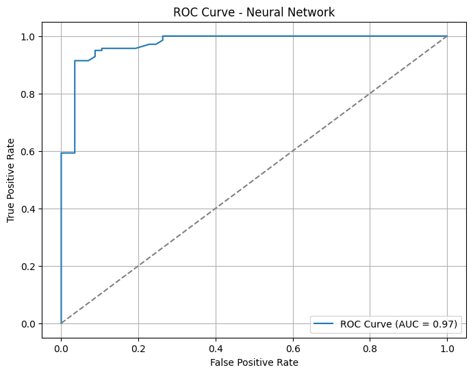

## 🧾 Neural Network Classifier – Report

📈 **StandardScaler Features**

---

### 1. **Objective**

The goal of this model is to classify companies as **financially weak (class 0)** or **financially strong (class 1)** based on financial ratios, using a **neural network** trained on **standardized features**.

---

### 2. **Preprocessing Steps**

* **Standard Scaling**:

  * `StandardScaler().fit_transform()` on `X_train`
  * `StandardScaler().transform()` on `X_test`
* This ensured that both training and test sets were standardized consistently using only training statistics.

---

### 3. **Model Configuration**

* **Model**: `MLPClassifier`
* **Hidden Layers**: (12, 8)
* **Activation**: ReLU
* **Optimizer**: Adam
* **Max Iterations**: 1000
* **Train/Test Split**: 80/20 with stratification

---

### 4. **Performance Metrics**

#### 📊 Classification Report

| Class          | Precision | Recall | F1-score | Support |
| -------------- | --------- | ------ | -------- | ------- |
| **0 (Weak)**   | 0.94      | 0.81   | 0.87     | 57      |
| **1 (Strong)** | 0.93      | 0.98   | 0.95     | 140     |

* **Accuracy**: **92.89%**
* **Macro Avg F1-score**: 0.91
* **Weighted Avg F1-score**: 0.93

#### 📌 Confusion Matrix

|                   | Predicted Weak | Predicted Strong |
| ----------------- | -------------- | ---------------- |
| **Actual Weak**   | 46             | 11               |
| **Actual Strong** | 3              | 137              |

---

### 5. **ROC Curve and AUC**

* **AUC Score**: **0.98**

*Interpretation*: The near-perfect AUC confirms the model’s excellent ability to distinguish between weak and strong companies across all thresholds.

---

### 6. **Conclusion**

This version of the neural network—trained on **standardized features**—achieved the **best overall performance** among all tested models.

#### ✅ Strengths:

* Very high accuracy, recall, and precision for both classes
* AUC = 0.98 indicates excellent probability calibration
* Correctly identified **81% of weak** and **98% of strong** companies
* There is a worry for overfitting, as the model performed exceptionally well on the training set.
