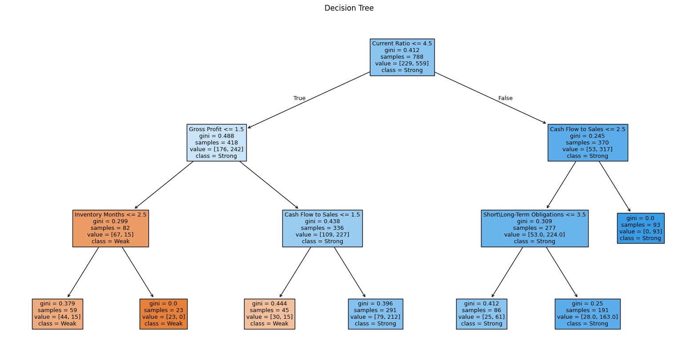

## 🧾 **Decision Tree Classifier Report**

### 1. **Objective**

This section presents the application of a **Decision Tree Classifier** to analyze financial data of companies and predict their financial resilience. The target variable is `Grade`, where:

* `1` = Weak financial resilience
* `2` = Strong financial resilience

The goal is to identify which financial ratios most effectively predict the target class, and to evaluate the model's performance on unseen data.

---

### 2. **Features Used**

The model was trained on the following financial ratios:

* Gross Profit
* Current Ratio
* Quick Ratio
* Inventory Months
* Cash Flow to Sales
* Obligators Months
* Self-Capital to Total Assets
* Short\Long-Term Obligations
* Additional Sales This Year / Sales Previous Year

---

### 3. **Model Training**

* The dataset was split into training (80%) and testing (20%) subsets.
* A `DecisionTreeClassifier` from scikit-learn was trained using default parameters.
* No normalization or scaling was applied, as decision trees do not require feature scaling.

---

### 4. **Feature Importance**

| Feature                                      | Importance |
| -------------------------------------------- | ---------- |
| Gross Profit                                 | 0.378      |
| Current Ratio                                | 0.376      |
| Inventory Months                             | 0.156      |
| Cash Flow to Sales                           | 0.047      |
| Quick Ratio                                  | 0.029      |
| Obligators Months                            | 0.015      |
| Self-Capital to Total Assets                 | 0.000      |
| Short\Long-Term Obligations                  | 0.000      |
| Additional Sales This Year / Sales Last Year | 0.000      |

🔍 *Conclusion*: The most important predictors are **Gross Profit** and **Current Ratio**, which together account for over 75% of the model’s decision-making.

---

### 5. **Tree Visualization**

A plot of the decision tree reveals a hierarchical decision process:

* The **root node** splits on `Current Ratio ≤ 4.5`
* The left branch further splits based on `Gross Profit` and `Quick Ratio`, leading to the identification of weak companies
* The right branch (Current Ratio > 4.5) mostly leads to strong companies, further evaluated by `Cash Flow to Sales` and `Obligators Months`

The tree reflects intuitive financial logic, such as associating **low liquidity** and **low profit margins** with financial weakness.

---

### 6. **Model Evaluation**

#### 📉 Classification Report

| Class      | Precision | Recall | F1-Score | Support |
| ---------- | --------- | ------ | -------- | ------- |
| 1 (Weak)   | 0.68      | 0.34   | 0.45     | 50      |
| 2 (Strong) | 0.81      | 0.95   | 0.87     | 147     |

* **Accuracy**: 79.2%
* **Macro Avg F1-Score**: 0.66
* **Weighted Avg F1-Score**: 0.77

#### 📊 Confusion Matrix

|                   | Predicted Weak | Predicted Strong |
| ----------------- | -------------- | ---------------- |
| **Actual Weak**   | 17             | 33               |
| **Actual Strong** | 8              | 139              |

#### ✅ Insights:

* The model is **highly effective at identifying strong companies** (recall = 95%).
* It **struggles to detect weak companies**, correctly identifying only 34% of them.
* There is a **bias toward the majority class (strong)**, possibly due to class imbalance.

---

### 7. **Conclusion**

The Decision Tree model provides **interpretable rules** and performs well overall. However, its limited sensitivity to the minority class (financially weak companies) may present risks in real-world applications where detecting financially vulnerable firms is critical. Future improvements could include:

* Using **class balancing techniques** (e.g., SMOTE)
* Applying **cost-sensitive learning**
* Comparing results with alternative models (Logistic Regression, Neural Network)